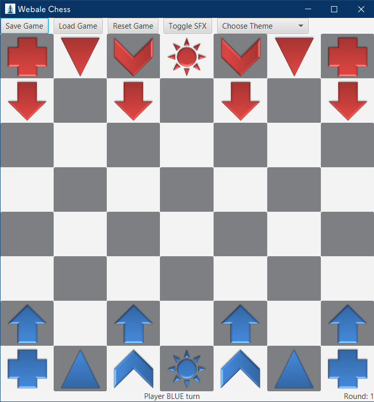

### Webale Chess Game
This is an university assignment which aims to design a Webale chess game using appropriate design pattern.
### Screenshot

### Development Guide
In order to compile the program using the source code, the user must have Java installed (recommended version 1.8.0_231-b11) and the JavaFX development environment set up (includes installing the JavaFX SDK). Then, the user can fire up a command prompt or terminal and use cd command to navigate to the “Program Source Code” folder. After that, just type in “javac ChessBoardView.java” and all the classes will be compiled and output to the same folder. At last, type in “java ChessboardView” to run the program. 